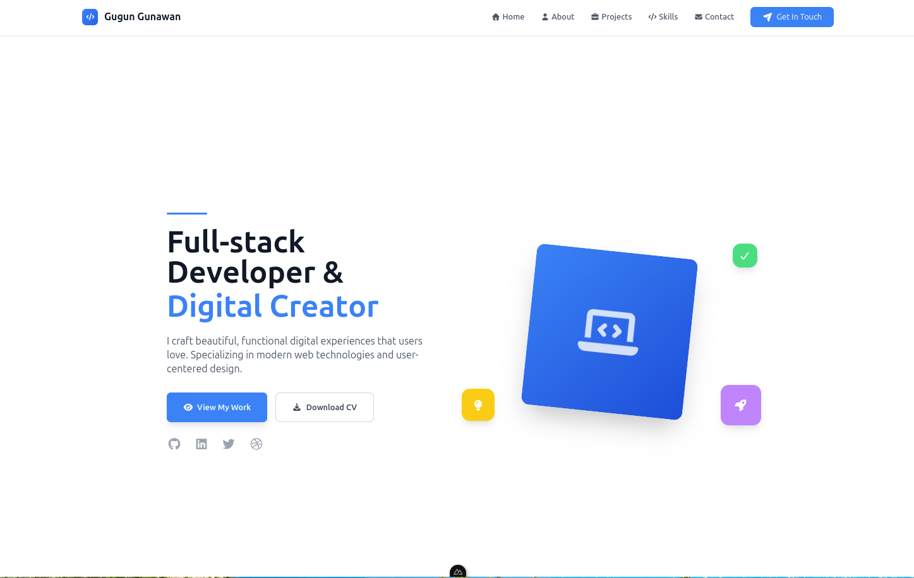

# **Portfolio Vue \- Dokumentasi**

## Screenshoot

## **📋 Deskripsi**

Sebuah website portfolio modern yang dibangun menggunakan Nuxt 3, Vue 3, dan Tailwind CSS. Proyek ini dirancang untuk menjadi responsif, cepat, dan mudah untuk dikustomisasi sesuai kebutuhan Anda.

## **🎨 Fitur**

* **✅ Desain Responsif:** Tampilan optimal di semua perangkat, dari mobile hingga desktop.  
* **✅ UI Modern:** Didesain dengan Tailwind CSS untuk antarmuka yang bersih dan modern.  
* **✅ Animasi Halus:** Transisi dan animasi yang mulus untuk pengalaman pengguna yang lebih baik.  
* **✅ Ikon Font Awesome:** Terintegrasi dengan Font Awesome untuk ikon yang tajam dan skalabel.  
* **✅ Dukungan TypeScript:** Kode yang lebih aman dan mudah dikelola dengan TypeScript.  
* **✅ Menu Hamburger Mobile:** Navigasi yang mudah di perangkat mobile dengan deteksi klik di luar.  
* **✅ Formulir Kontak:** Formulir fungsional untuk menerima pesan dari pengunjung.  
* **✅ SEO Optimized:** Struktur yang dioptimalkan untuk mesin pencari.

## **🛠 Tech Stack**

* **Framework:** [Nuxt 3](https://nuxt.com/)  
* **Frontend:** [Vue 3](https://vuejs.org/), [TypeScript](https://www.typescriptlang.org/)  
* **Styling:** [Tailwind CSS](https://tailwindcss.com/)  
* **Ikon:** [Font Awesome](https://fontawesome.com/)  
* **Composable:** [VueUse](https://vueuse.org/)  
* **Deployment:** Vercel, Netlify, atau platform hosting statis lainnya.

## **🚀 Quick Start**

### **Prerequisites**

Pastikan Anda telah menginstal versi berikut:

* Node.js 18.0.0 atau yang lebih baru  
* npm, yarn, pnpm, atau bun

### **Instalasi**

1. **Clone repository ini:**  
   git clone \<repository-url\>  
   cd nama-folder-proyek

2. **Install dependencies:**  
   \# npm  
   npm install

   \# yarn  
   yarn install

3. **Install library tambahan (Font Awesome & VueUse):**  
   npm install @fortawesome/vue-fontawesome@latest @fortawesome/fontawesome-svg-core @fortawesome/free-solid-svg-icons @fortawesome/free-brands-svg-icons  
   npm install @vueuse/nuxt @vueuse/core

### **Menjalankan Server Development**

Jalankan server development di http://localhost:3000:

npm run dev

### **Build untuk Produksi**

Membangun aplikasi untuk mode produksi:

npm run build

### **Preview Hasil Build Produksi**

Menjalankan preview lokal dari build produksi:

npm run preview

## **🚀 Deployment**

Proyek ini dapat di-deploy ke platform mana pun yang mendukung hosting situs statis.

### **Vercel**

Platform Vercel akan secara otomatis mendeteksi konfigurasi Nuxt dan men-deploy proyek Anda.

### **Netlify**

1. Build proyek Anda:  
   npm run build

2. Upload folder dist/ ke Netlify.

Untuk informasi lebih lanjut, lihat [dokumentasi deployment Nuxt](https://nuxt.com/docs/getting-started/deployment).

## **📁 Struktur Proyek**

.  
├── app.vue                   \# Layout utama aplikasi  
├── assets/                   \# Aset seperti CSS atau gambar  
├── components/               \# Komponen Vue yang dapat digunakan kembali  
│   ├── sections/             \# Komponen untuk setiap bagian (About, Projects, dll.)  
│   └── ui/                   \# Komponen UI (Header, Button, Card, dll.)  
├── composables/              \# Fungsi composable Vue  
├── layouts/                  \# Template layout  
├── nuxt.config.ts            \# File konfigurasi Nuxt  
├── pages/                    \# Halaman aplikasi  
├── plugins/                  \# Plugin Nuxt (cth: Font Awesome)  
├── public/                   \# Aset publik (favicon, robots.txt)  
├── tailwind.config.js        \# File konfigurasi Tailwind CSS  
├── tsconfig.json             \# File konfigurasi TypeScript  
└── types/                    \# Definisi tipe TypeScript

## **🔄 Troubleshooting**

* **Menu Hamburger tidak berfungsi:** Pastikan @vueuse/nuxt dan @vueuse/core sudah terinstall dengan benar.  
* **Ikon tidak muncul:** Periksa kembali konfigurasi Font Awesome di plugins/fontawesome.ts.  
* **Error saat build:** Hapus cache dengan menjalankan rm \-rf .nuxt node\_modules/.vite dan install ulang dependencies.